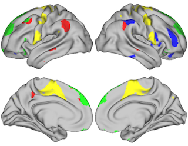

# VISUALIZATION OF BRAIN SURFACE DATA

This package provides the functionality of visualizing data on a standard brain surface. This package leverages brain visualization functionality available in the connectome workbench made available as part of the Human Connectome Project [1]. 

This package provides two visualization options:
1.	Visualize selected regions of interest on the brain surface (see Fig 1)
2.	Visualize a desired metric for each region in a brain parcellation (see Fig 2)





## Requirements

Operating systems: Linux, OS X

Software: Workbench Command [1] that can be called using *$wb_command*

## Usage
**1. Mode 1**

   How to run:
   
   ```
   $chmod +x plotSurface.sh

   $./plotSurface.sh [input_file] [output_file] [img_width] [img_height]
   ```

   Input:
   - **input_file** (optional): the text file (.txt) that contains the index of each region to be highlighted (mode 1) or the value of each region (mode 2). Users can either provide the path to the new input file or changing the content of the file region.txt and not using this parameter.
         
         Mode 1: to highlight the regions of indices 2, 39, 45, the content of **input_file** shall consist of the following 3 lines:
         
                  2
                  39                  
                  45
                  
         Mode 2: for a parcellation with n regions, the *input_file* shall consist of n rows only, in which row i represents the value of region i.
   - **output_file** (optional): the name (with path) of the output image. When this parameter is not provided, the output image will be saved as brain_image.txt in ../
   - **img_width** (optional): the width of the output image in pixel. Default: 900
   - **img_height** (optional): the height of the output image in pixel. Default: 700

**2. Mode 2**

## Change the parcellation

The default parcellation consists of 100 brain regions. To change it, the user needs to replace the contents of two files *standard.dlabel.nii* and *standard.dscalar.nii* in the *scene_files* folder with the those of the new parcellation.

## References

[1] Human Connectome Project. https://www.humanconnectome.org
[2] Workbench. https://www.humanconnectome.org/software/workbench-command
