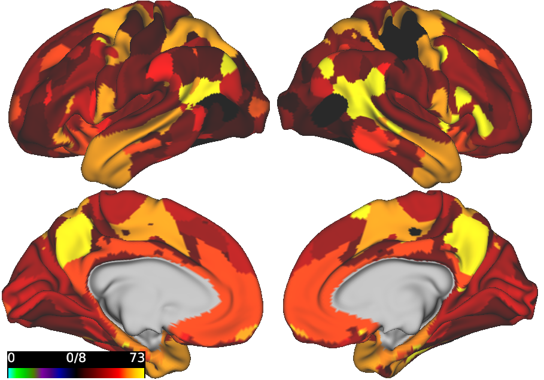

# VISUALIZATION OF BRAIN SURFACE USING fMRI DATA

This package provides the visualization of a brain surface using fMRI data of a specific parcellation. The brain surface can be visualized in two configurations:

- Selected brain regions are colored

- All brain regions are colored according to their given values



# Requirements:

Operating systems: Linux, OS X

Software: Workbench Command [1] that can be called using $wb_command

## Usage
How to run:
```bash
chmod +x plotSurface.sh

./plotSurface.sh [input_file] [output_file] [img_width] [img_height]
```

Input:
- **input_file** (optional): the text file (.txt) that contains the index of each region to be highlighted, each index is on a separate row. Users can either provide the path to the new input file or changing the content of the file region.txt and not using this parameter.
- **output_file** (optional): the name (with path) of the output image. When this parameter is not provided, the output image will be saved as brain_image.txt in ../
- **img_width** (optional): the width of the output image in pixel. Default: 900
- **img_height** (optional): the height of the output image in pixel. Default: 700

## References

[1] Workbench. https://www.humanconnectome.org/software/workbench-command
